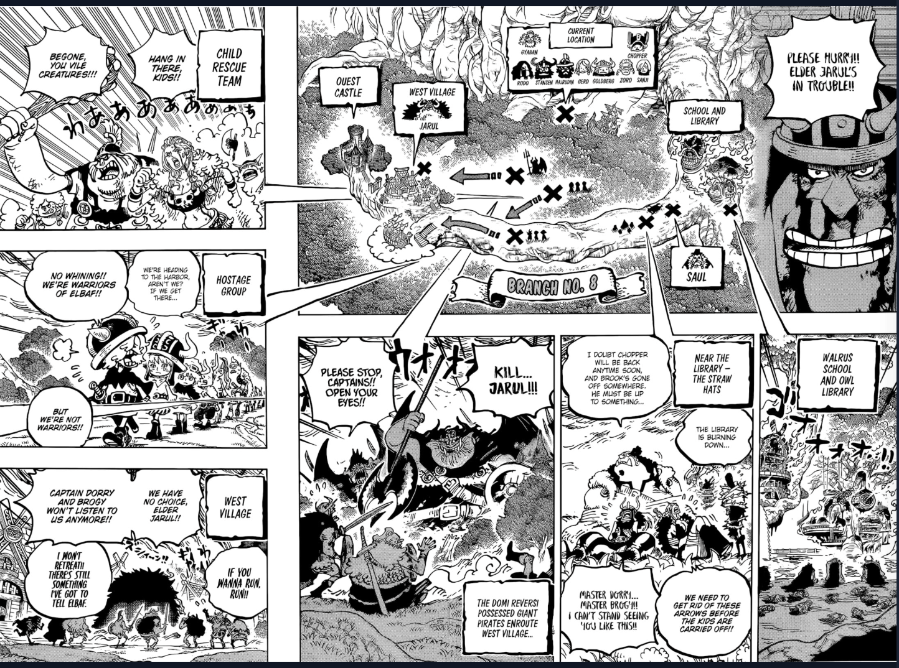
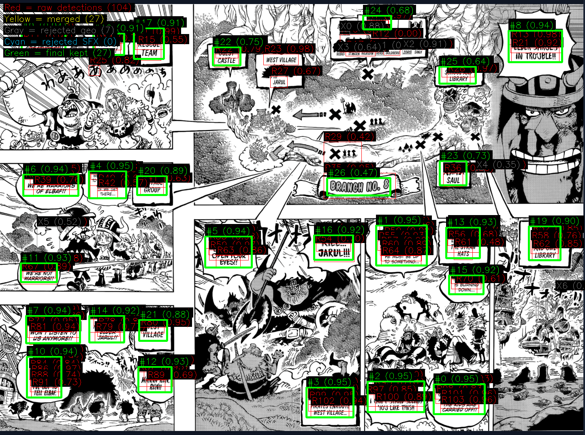
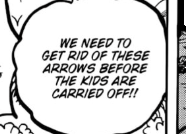
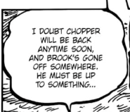
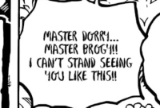

# Manga Voice Reader

A Chrome extension + local Python server that detects speech bubbles in manga pages, reads them aloud with AI voice, and highlights each bubble as it's spoken. Fully local — no cloud APIs, no paid services, no data leaves your machine.

### Original Manga Page


### AI Bubble Detection (RT-DETR-v2 + PaddleOCR)

*Green boxes = detected speech bubbles. Dark overlays = extracted OCR text. The system finds every bubble, reads the text, filters out sound effects, and sorts them in reading order.*

### Individual Bubble Crops (Fed to OCR)
| | | |
|:---:|:---:|:---:|
|  |  |  |
| "We need to get rid of these arrows before the kids are carried off!!" | "I doubt Chopper will be back anytime soon, and Brook's gone off somewhere. He must be up to something..." | "Master Dorri! Master Brog'!! I can't stand seeing you like this!" |

### OCR Output (27 bubbles detected on this page)
```
[1]  Please hurry!! Elder Jarl's in trouble!!
[2]  Begone, you vile creatures!!
[3]  Hanging there, kids!!
[6]  No whining!! We're warriors of Elbaf!!
[14] I doubt Chopper will be back anytime soon, and Brook's gone off
     somewhere. He must be up to something...
[23] Master Dorri! Master Brog'!! I can't stand seeing you like this!
[24] We need to get rid of these arrows before the kids are carried off!!
[27] I won't retreat!! There's still something I've got to tell Elbaf.
```

## How It Works

1. Open any manga page in Chrome
2. Click **Read Page** — the extension screenshots the visible page
3. The screenshot is sent to a local Python server running on your machine
4. **RT-DETR-v2** detects speech bubbles, **PaddleOCR + Florence-2** extract the text
5. **Kokoro TTS** generates natural speech for each bubble
6. The extension plays audio and highlights each bubble in reading order

The entire pipeline runs in ~3-5 seconds per page depending on hardware.

## Features

- **6 AI models** working together — bubble detection, text segmentation, OCR (x2), text classification, TTS
- **54 voices** across 8 languages (English, British, Spanish, French, Hindi, Italian, Japanese, Chinese, Portuguese)
- **RTL/LTR/Vertical** reading direction support for manga, comics, and webtoons
- **Auto-read** — automatically advances and reads the next page when done
- **Smart text cleanup** — handles OCR noise, merged words, SFX filtering, gibberish detection
- **Bubble overlay** — highlights the bubble currently being read
- **Keyboard shortcuts** — Space (play/pause), arrow keys (skip bubble)
- **Speed control** — 0.5x to 2.0x playback speed
- **Page caching** — won't re-process identical screenshots
- **Debug dashboard** — live pipeline visualization at `localhost:5055/debug/frame`
- **Auto-shutdown** — server shuts down after 30 minutes of inactivity
- **CPU throttling** — configurable thread caps to prevent fan noise / CPU spikes

## AI Models Used

| Model | Purpose | Size | Speed |
|-------|---------|------|-------|
| RT-DETR-v2 (ONNX) | Speech bubble detection | 168MB | ~600-900ms |
| Comic Text Segmenter (ONNX) | Text region segmentation | 90MB | ~200ms |
| PaddleOCR PP-OCRv5 | Text recognition (primary) | ~150MB | ~1-2s |
| Florence-2 Large FT | VLM OCR (GPU, secondary) | ~1.5GB VRAM | ~1-2s |
| MangaCNN (ONNX) | Dialogue vs SFX classifier | ~5MB | ~10ms |
| Kokoro v1.0 (ONNX) | Text-to-speech (54 voices) | 337MB | ~850ms/bubble |
| Piper (ONNX) | TTS fallback | 60MB | ~94ms/bubble |

## Processing Pipeline

```
Screenshot → Crop → Bubble Detection (RT-DETR-v2)
                  → PaddleOCR Detection (parallel)
                        ↓
              Bubble Grouping → Pre-SFX Filter
                        ↓
              Multi-OCR (PaddleOCR + Tesseract + Florence-2)
                        ↓
              Dialogue vs SFX Classification (MangaCNN)
                        ↓
              Text Cleanup → Case Normalization → Word Splitting
              → Spell Correction → Manga Corrections → Sentence Case
                        ↓
              Reading Order Sort (RTL/LTR/Vertical)
                        ↓
              TTS Generation (Kokoro) → Audio Playback
```

## Requirements

- **Python 3.11+**
- **GPU recommended** (NVIDIA with CUDA for Florence-2), CPU-only works but slower
- **Tesseract OCR** installed on system (`brew install tesseract` / `apt install tesseract-ocr`)
- **Chrome browser** with Developer Mode enabled

### Hardware Tested On

- **Windows PC**: RTX 3080 10GB, CUDA 12.6 — full pipeline ~3s/page
- **MacBook Air M4**: 16GB RAM, CPU-only — works but slower (~6-8s/page)

## Setup

### 1. Install the Server

```bash
cd server
python -m venv venv
source venv/bin/activate  # Windows: venv\Scripts\activate
pip install -r requirements.txt
```

Additional packages needed (not all in requirements.txt yet):

```bash
pip install kokoro-onnx soundfile wordninja symspellpy piper-tts torch torchvision transformers
```

### 2. Download Models

Create `server/models/` directory and download these:

- **Kokoro TTS** → `server/models/kokoro/`
  - [`kokoro-v1.0.onnx`](https://github.com/thewh1teagle/kokoro-onnx/releases/tag/model-files) (310MB)
  - [`voices-v1.0.bin`](https://github.com/thewh1teagle/kokoro-onnx/releases/tag/model-files) (27MB)
- **Piper TTS** (fallback) → `server/models/piper/`
  - [`en_US-lessac-medium.onnx`](https://huggingface.co/rhasspy/piper-voices/tree/main/en/en_US/lessac/medium) + `.json` config
- **Bubble Detector** → `server/models/`
  - [`detector.onnx`](https://huggingface.co/ogkalu/comic-text-and-bubble-detector) (168MB) — RT-DETR-v2 trained on 11,000 comic images
- **Text Segmenter** → `server/models/`
  - [`comictextdetector.pt.onnx`](https://huggingface.co/ogkalu/comic-text-and-bubble-detector) (90MB)

### 3. Start the Server

```bash
cd server
python server.py
```

Server runs on `http://127.0.0.1:5055`.

### 4. Install the Chrome Extension

1. Open `chrome://extensions`
2. Enable **Developer Mode**
3. Click **Load unpacked** → select the `extension/` folder
4. Pin the extension icon in your toolbar

## Usage

1. Go to any manga website (MangaFire, MangaDex, Webtoons, etc.)
2. Click the extension icon → **Open Reader on This Page**
3. A floating panel appears in the bottom-right
4. Click **Read Page** — bubbles are detected, text is read aloud
5. Each bubble highlights as it's spoken

### Controls

| Control | Action |
|---------|--------|
| Read Page | Screenshot + detect + read all bubbles |
| Space | Play / Pause |
| Left/Right Arrow | Skip to previous / next bubble |
| Stop | Stop reading |
| Settings | Voice, speed, overlay mode, reading direction |

### Reading Directions

- **RTL** — Right-to-left (standard manga)
- **LTR** — Left-to-right (Western comics)
- **Vertical** — Top-to-bottom (webtoons/manhwa)

## Configuration

All settings can be overridden via environment variables with `MVR_` prefix:

```bash
# Reduce CPU usage (default: 2 threads per library)
MVR_CPU_THREAD_CAP=2
MVR_ONNX_THREAD_CAP=2
MVR_TORCH_THREAD_CAP=2

# Server port
MVR_PORT=5055

# Idle shutdown timer (minutes)
MVR_IDLE_TIMEOUT=30

# Detection tuning
MVR_MAX_DETECT_WIDTH=1280
MVR_MIN_DET_SCORE=0.10
```

See `server/config.py` for all available options.

## Auto-Start (Windows)

A lightweight launcher service (`launcher.py`) can run on boot via Windows Task Scheduler:

1. Listens on port 5056 with minimal resources
2. When the Chrome extension connects, it starts the full server on port 5055
3. Server auto-shuts down after 30 minutes of inactivity

## Project Structure

```
manga-voice-reader/
├── extension/                  # Chrome extension
│   ├── manifest.json           # Extension manifest (MV3)
│   ├── content.js              # UI panel, overlay, TTS playback, auto-read
│   ├── background.js           # Service worker, HTTP proxy, server detection
│   ├── popup.html / popup.js   # Extension popup
│   ├── styles.css              # Floating panel styles
│   └── icons/                  # Extension icons
├── server/                     # Local Python server
│   ├── server.py               # Flask server, main pipeline
│   ├── config.py               # All tunable parameters
│   ├── bubble_detection.py     # RT-DETR-v2 + merging + sorting
│   ├── ocr_engines.py          # PaddleOCR, Florence-2, Tesseract, MangaCNN
│   ├── text_processing.py      # Cleanup, spell correction, formatting
│   ├── tts_engine.py           # Kokoro + Piper TTS
│   ├── comic_text_segmenter.py # Text mask segmentation
│   ├── launcher.py             # Lightweight boot launcher (Windows)
│   ├── requirements.txt        # Python dependencies
│   └── models/                 # AI model files (not in repo)
└── README.md
```

## Supported Sites

Works on any manga website. Pre-configured content script injection for:

- MangaFire
- MangaDex
- MangaKakalot / MangaNato
- MangaReader
- ReadM
- ManhuaPlus
- Webtoons
- MangaBuddy
- MangaPill
- MangaRead
- AsuraScans / ReaperScans / FlameScans

Can be used on any other site via the extension popup → "Open Reader on This Page".

## Development Challenges & Fixes

Building this involved solving a lot of real-world problems across AI, browser security, site-specific quirks, and performance. Here's a detailed breakdown.

---

### OCR Text Reconstruction (The Hardest Part)

PaddleOCR returns ALL CAPS text with frequent errors. Turning raw OCR output into natural readable sentences required a deep pipeline:

**The "swordsmanship" saga** — OCR read it as `"swords man ship"`. Took 10+ attempts to fix. wordninja splits it into `['swordsman', 'ship']` (2 words, not 1). Tried: fragment rejoining, span limits, suffix detection, compound word lists. Final fix: direct pattern replacement applied before AND after word splitting.

**The fundamental case problem** — All text-fixing logic assumed lowercase, but PaddleOCR returns ALL CAPS. Every regex, every word split, every spell check was silently failing on real data. Fix: early case normalization — if >60% uppercase, convert to lowercase first, then restore sentence case at the end. This single change was the biggest quality improvement.

**PaddleOCR reads "I" as "/" or "l"** — `"/SPENT"` should be `"I spent"`, `"lam"` should be `"I am"`, `"lt's"` should be `"It's"`. Built a multi-layer fix: regex patterns for slash-as-I, standalone `l` → `I`, `l'` → `I'`, plus 20+ entries in manga_corrections.json.

**Merged words from Florence-2** — The VLM returns words merged together: `"CAMETO"`, `"HISNUMBERS"`, `"BYASSISTING"`. Built `_florence_join_lines()` that splits merged words using wordninja and validates every part against an 82,000-word SymSpell dictionary. Only accepts splits where ALL parts are real words.

**Other OCR fixes solved:**

| OCR Output | Fixed To |
|------------|----------|
| swords man ship | swordsmanship |
| once aweek | once a week |
| l was I m proving | I was improving |
| Ifl didnt take | If I didn't take |
| WHETHER/WAS | whether I was |
| /SPENT | I spent |
| NOTGONNA | not gonna |
| SHE'SA | she's a |
| at ten tine | attentive |

---

### Bubble Detection Issues

**Coordinate swap bug** — RT-DETR-v2's `orig_target_sizes` expects `[width, height]`, not `[height, width]`. All detected boxes were out of bounds until this was caught.

**Duplicate bubble detections** — IoU-based NMS missed cases where a small box was fully contained inside a larger one (IoU only 0.25 even with 100% overlap). Fix: added containment check — if >60% of smaller box is inside larger box, drop the smaller one.

**Dark area garbage in OCR** — Bubble detector boxes extend into dark artwork surrounding speech bubbles. OCR reads patterns in the artwork as text (e.g. `"DEMSIEl"`). Fix: white-area masking — detect the white bubble interior and replace dark areas with white before running OCR.

**Cross-panel merge bug** — The mask-based fallback detector had no maximum size limit. Text components chain-merged from top to bottom, combining a Japanese title with English dialogue into one giant "bubble." Fix: max height 35%, max width 55% of page.

**Fallback trigger** — The bubble detector sometimes finds 3 bubbles on a page that actually has 7. Meanwhile PaddleOCR finds 43 text boxes. Detection: if `text_boxes > bubble_boxes * 8`, switch to mask-based grouping. Each bubble typically contains 5-8 text lines, so this ratio catches under-detection.

---

### Auto-Next Page Navigation

Getting automatic page advancement to work on manga sites was a multi-day battle:

**Attempt 1: HTMLElement.click()** — `.click()` sends `clientX=0, clientY=0`. The manga site checks click coordinates to determine direction. Always went to the previous page.

**Attempt 2: MouseEvent with coordinates** — Correct coordinates but `isTrusted` is always `false`. The site ignores untrusted mouse events.

**Attempt 3: Chrome Debugger API** — `chrome.debugger` with `Input.dispatchMouseEvent` would send truly trusted events, but the manga site detects debugger attachment and reloads the page.

**Attempt 4: Injecting script tags** — Blocked by the site's Content Security Policy. Inline scripts silently fail.

**Attempt 5: Content script clicking DOM links** — The page has `<a data-page="N">` links, but clicking from the content script's isolated world doesn't trigger the site's jQuery handlers.

**What finally worked: `chrome.scripting.executeScript` with `world: 'MAIN'`** — This Chrome API runs code in the page's own JavaScript context, bypasses CSP, and can interact with the site's Swiper.js carousel directly. First tried sending ArrowRight keyboard events (works but Swiper doesn't check `isTrusted` on keyboard events). Then switched to clicking `a[data-page]` links directly from MAIN world, which is more reliable.

**RTL direction bug** — Manga sites using Swiper with RTL layout have inverted page numbering. Page 14 is the first page, page 1 is the last. The code was doing `currentPage + 1` to go forward, which actually went backward. Fix: `isRTL ? currentPage - 1 : currentPage + 1`.

**Wrap-around detection** — After clicking next page, if the page number jumped in the wrong direction (went UP in RTL mode), it means the carousel wrapped around instead of advancing. The code detects this and stops auto-read instead of looping forever.

---

### CPU Spikes & Fan Noise

**Problem:** Every time "Read Page" was clicked, CPU spiked to ~50% and the PC fans went loud. On a gaming PC with an RTX 3080, this was unnecessary and annoying.

**Root cause:** ONNX Runtime, PyTorch, and PaddlePaddle all default to using ALL available CPU threads in parallel. When multiple models run (bubble detection + OCR + text classification), they fight over CPU threads and cause massive spikes.

**Fix:** Thread caps at three levels:
1. **Environment variables** (before any imports): `OMP_NUM_THREADS=2`, `MKL_NUM_THREADS=2`, `OPENBLAS_NUM_THREADS=2`, `NUMEXPR_NUM_THREADS=2`, `FLAGS_num_threads=2`
2. **ONNX Runtime**: `SessionOptions.inter_op_num_threads=2`, `intra_op_num_threads=2`
3. **PyTorch**: `torch.set_num_threads(2)`

**Result:** Peak CPU dropped from ~50% to ~25%. No quality regression — same bubble count, same text accuracy. Configurable via `MVR_CPU_THREAD_CAP`, `MVR_ONNX_THREAD_CAP`, `MVR_TORCH_THREAD_CAP` environment variables. Set to 0 to disable caps.

---

### Mixed Content Blocking

**Problem:** Manga sites use HTTPS. The local server runs on HTTP. Chrome blocks HTTP requests from HTTPS pages ("Mixed Content"). This silently broke ALL server communication — TTS, health checks, voice loading, everything.

**Fix:** Routed all HTTP requests through the background service worker via `chrome.runtime.sendMessage()`. Service workers are not subject to Mixed Content restrictions. The content script never makes direct HTTP calls anymore — everything goes through the background proxy.

**Gotcha:** After reloading the extension, close and reopen the manga tab. The old content script keeps running with a broken `chrome.runtime` connection ("Extension context invalidated").

---

### PaddleOCR on Windows

**Problem:** PaddlePaddle crashed on startup on Windows with cryptic errors.

**Root cause:** Two PaddlePaddle features cause crashes on Windows:
- oneDNN (MKL-DNN) memory allocation issues
- PIR mode (Program Intermediate Representation) incompatibility

**Fix:** Disable both before import:
```python
os.environ['FLAGS_use_mkldnn'] = '0'
os.environ['FLAGS_enable_pir_in_executor'] = '0'
```

---

### PP-OCRv5 Upgrade

**Attempt 1: Server Detection model (84MB)** — OOM killed at 2.6GB RAM (exit code 137). Way too heavy.

**Attempt 2: Mobile Detection + Server Recognition** — Loaded in 1.5 seconds, no memory issues. The server recognition model was the real quality upgrade:

| Text | OCRv4 | OCRv5 Server Rec |
|------|-------|------------------|
| ATTENTIVE | ATTENTINE | VERY ATTENTIVE |
| YOU'VE | YOUVE | YOU'VE |
| A WEEK | AWEEK | A WEEK |
| CRAP OUT | CRAPOUT | CRAP OUT |

---

### TTS Voice Selection

Tested 12+ TTS models before settling on Kokoro:

| Model | Quality | Speed | Why Not |
|-------|---------|-------|---------|
| espeak/Festival | 3/10, robotic | Instant | Sounds terrible |
| Piper (medium) | 5/10, robotic | 94ms | Good fallback, not primary quality |
| Piper (high) | 6/10 | 748ms | Too slow for marginal improvement |
| Bark (Suno) | 8/10 | 10-30s | Unusably slow |
| Coqui/XTTS | 8/10 | Slow | Too heavy to run locally |
| Tortoise TTS | 9/10 | Minutes | Unusably slow |
| Chatterbox | 9/10 | 2.8s/bubble | Installed, then removed — too slow, 4.2GB VRAM |
| **Kokoro** | **9/10** | **850ms** | **Chosen.** Natural, emotional, 54 voices, 337MB |

Chatterbox was installed and working but removed — 2.8s per bubble delay was too noticeable vs Kokoro's 850ms. Removing it also freed 4.2GB VRAM and cut server startup from 30s to 13s.

**Piper optimization journey:** Started with subprocess spawning (2-3s per sentence, loading model each time) → persistent subprocess (unreliable) → Python API with in-memory model (748ms high, 94ms medium) → JIT warmup at startup (37-82ms). Then switched to Kokoro entirely.

---

### Crop Area Detection

**Problem:** The extension needs to screenshot just the manga area, not the entire browser window (with navigation bars, ads, etc.). Early versions sent a 10-pixel-wide vertical strip to the server.

**Root cause:** `getMangaCropRect()` was finding the wrong `minLeft` value when calculating the union of visible manga images.

**Fix:** Rewrote to find the largest visible `` elements, compute their union rectangle, and account for `object-fit: contain` offset (images rendered smaller than their element box). Server-side fallback: if the crop is less than 15% of the screenshot in either dimension, use the full screenshot instead.

---

### Highlight Overlay Positioning

**Problem:** Bubble highlights appeared offset from the actual speech bubbles — shifted to the side.

**Root cause:** Manga images use CSS `object-fit: contain`, which scales the image to fit its container while maintaining aspect ratio. The rendered image is smaller than the `` element, with padding on the sides. The overlay was positioned relative to the element box, not the rendered image.

**Fix:** `getObjectFitOffset()` calculates the exact dx/dy offset between the element box and the rendered image, then applies it to all bubble overlay coordinates.

---

### Chrome Extension Manifest

**Problem:** Extension showed "Cannot run on this page" on mangafire.to even though it was in the manifest's site list.

**Root cause:** `*://*.mangafire.to/*` matches `www.mangafire.to` and `sub.mangafire.to` but does NOT match the apex domain `mangafire.to` (no subdomain). This is a Chrome extension gotcha — the `*.` prefix requires at least one subdomain character.

**Fix:** Added both patterns:
```json
"*://mangafire.to/*",
"*://*.mangafire.to/*"
```

---

### Performance Optimization Attempts

**What worked:**
- Single-pass PaddleOCR on full page instead of per-crop (31s → 6.7s)
- Tesseract skip when PaddleOCR score is good enough (saves 200-500ms/crop)
- Bubble detection + PaddleOCR detection running in parallel threads (saves 2-4s)
- TTS pre-fetching: fetch next bubble's audio while current one plays
- Thread caps reducing CPU contention

**What failed:**
- **Strip-based OCR** — concatenating bubble crops into one image strip confused PaddleOCR's reading order. Text came out garbled: "You just want to follow US kill to time"
- **Parallel model execution** — Running bubble detection and PaddleOCR in the same parallel batch was actually SLOWER because both models fought for CPU threads (before thread caps were added)
- **Per-crop PaddleOCR** — Running full OCR detection on each individual bubble crop: 31 seconds per page (~6s per crop)

---

### SFX (Sound Effect) Filtering

Manga pages are full of sound effects drawn as stylized text: "BOOM", "CRASH", "WHOOOOSH", "SHURURU". These get detected as speech bubbles and OCR'd as text. Reading them aloud sounds terrible.

**Multi-layer filtering:**
1. **Geometric filter** — Reject boxes that are too small, too narrow, too rotated, or too large relative to the page
2. **MangaCNN classifier** — ONNX model trained to classify crops as dialogue vs non-dialogue
3. **SFX word list** — Known sound effect words get heavy score penalties
4. **Pattern detection** — Repeated letters ("WHOOOOSH"), repeated patterns, single words in large boxes
5. **Dialogue scoring** — Heuristic scoring system: real sentences score positive, SFX/noise scores negative. Gate at -4 points.

---

### Gibberish & Noise Detection

OCR reads background artwork, speed lines, and texture as text. Examples: `"Geom < ERA is: fn and = ; 2 % ii"`, `"Rrr Tii."`, `"ii ff qt u ny"`.

**Quality gates added:**
- **SymSpell dictionary check** — If >=50% of words are unknown, drop the text
- **Symbol garbage filter** — 6+ junk symbols (`_`, `¢`, `§`, `©`, `®`, etc.) = drop
- **Fragmented noise** — >40% single-character words = drop
- **All-unknown short text** — 4 or fewer words, all unknown to dictionary = drop
- **Repeated-letter noise** — Words with 2 or fewer unique characters that aren't dictionary words
- **Digit-heavy filter** — >12% digits with 3+ total digits = drop
- **Incoherent word soup** — 7+ words, >70% short, no sentence-ending punctuation = drop

---

### Windows Task Scheduler

**Problem:** Auto-start launcher wasn't running on PC boot.

**Root causes:**
1. "Disallow start if on batteries" was enabled — prevents task from starting even on desktop PCs that report battery status
2. Missing "Start In" working directory — Python couldn't find the server files

**Fix:** PowerShell script modifying the scheduled task settings to disable battery restrictions and set the correct working directory.

---

### DevTools Detection

mangafire.to detects when Chrome DevTools are open and resets/reloads the page. This made debugging the extension extremely difficult.

**Solution:** Built a forensic dump tool that runs entirely from the extension (no DevTools needed). Captures: all images with positions, page controls, Swiper structure, inline scripts, data attributes. Saved as a text file via `chrome.downloads` API.

---

### Cloudflare Rate Limiting

During early auto-next development, a broken auto-clicker looped rapidly and sent hundreds of requests to mangafire.to. Triggered Cloudflare Error 1015 "You are being rate limited."

**Fix:** Clear cookies for the site, or wait 15-30 minutes. Prevention: auto-next now has natural delays (voice reading time + animation wait) so it never sends rapid requests.

## Cost

Everything is free. No cloud APIs, no subscriptions, no usage limits.

| Component | Cost |
|-----------|------|
| All AI models | Free (open source) |
| Server | Free (runs locally) |
| Chrome extension | Free |
| TTS voices | Free (54 included) |

## License

MIT

Everything is free. No cloud APIs, no subscriptions, no usage limits.

| Component | Cost |
|-----------|------|
| All AI models | Free (open source) |
| Server | Free (runs locally) |
| Chrome extension | Free |
| TTS voices | Free (54 included) |

## License

MIT
